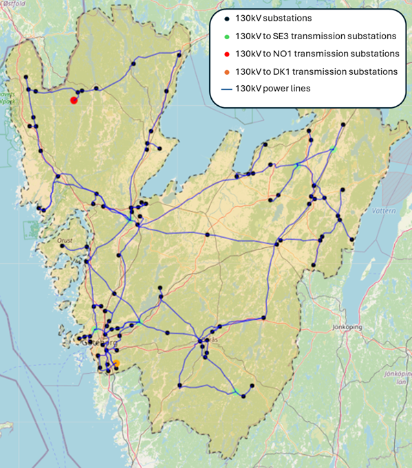

# ResystVGR
 Energy Systems Model (ESM) for Västra Götalandsregionen (West Coast), Sweden



## Usage

The mathematical formulation for the model can be found in [model description](src/model_description.pdf)

Set the config file(s) according to your preferred cases or scenarios which is located in ```\configs``` folder and put them in a list.

Currently the module works with ```HiGHS```, ```Gurobi```, and ```COPT``` solvers. Ensure that you have installed the required solver and licenses.

After the model run has finished, the results are presented as CSV files and can be found in ```\results``` folder

### Initiate dependencies

Navigate to the module folder in Julia REPL

```julia
julia> pwd()
"...\\ResystVGR"
```

Press `]` to enter Pkg REPL and activate with `.`

```julia
(@v1.12) pkg> activate .
  Activating project at `...\ResystVGR`

(ResystVGR) pkg>
```

You can check the initiated packages with the following.

```julia
(ResystVGR) pkg> st
Project ResystVGR v0.1.0
Status `...\ResystVGR\Project.toml`
  [...] COPT v1.1.33
  [...] CSV v0.10.16
  [...] DataFrames v1.8.1
  [...] Gurobi v1.9.2
  [...] HiGHS v1.23.0
  [...] JuMP v1.30.0
  [...] MAT v0.12.0
  [...] XLSX v0.11.2
  [...] SparseArrays v1.12.0
  [...] TOML v1.0.3
```

### Run the model

with `using` 
```julia
using ResystVGR

run_scenario("test", :highs) # run test configuration with HiGHS solver
```

with `import` 
```julia
import ResystVGR

ResystVGR.run_scenario("test", :highs) # run test configuration with HiGHS solver
```

## NB: data not uploaded yet
This repository contains the scripts and config files needed to run the Resyst model, but the input data to replicate the results are not uploaded. The required data can be made available upon request.